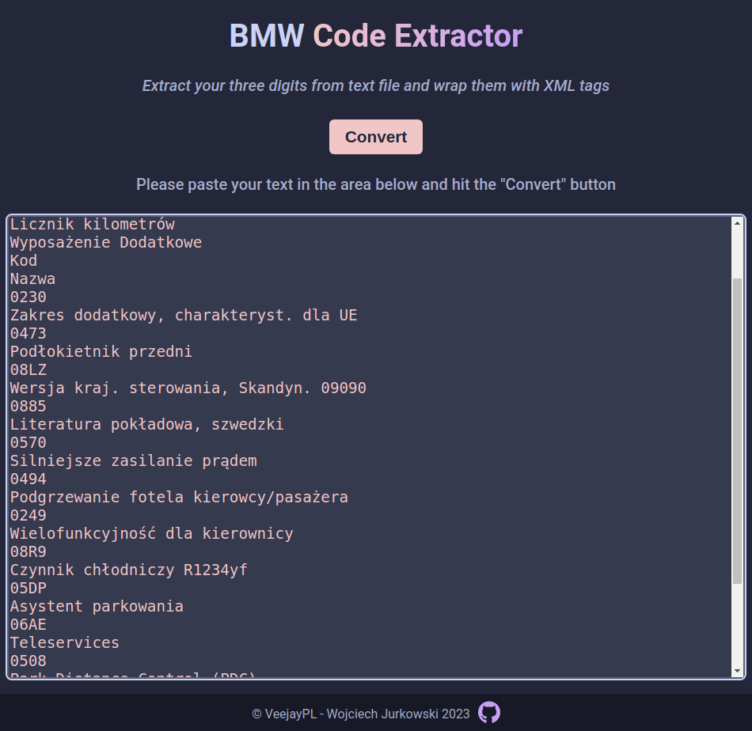
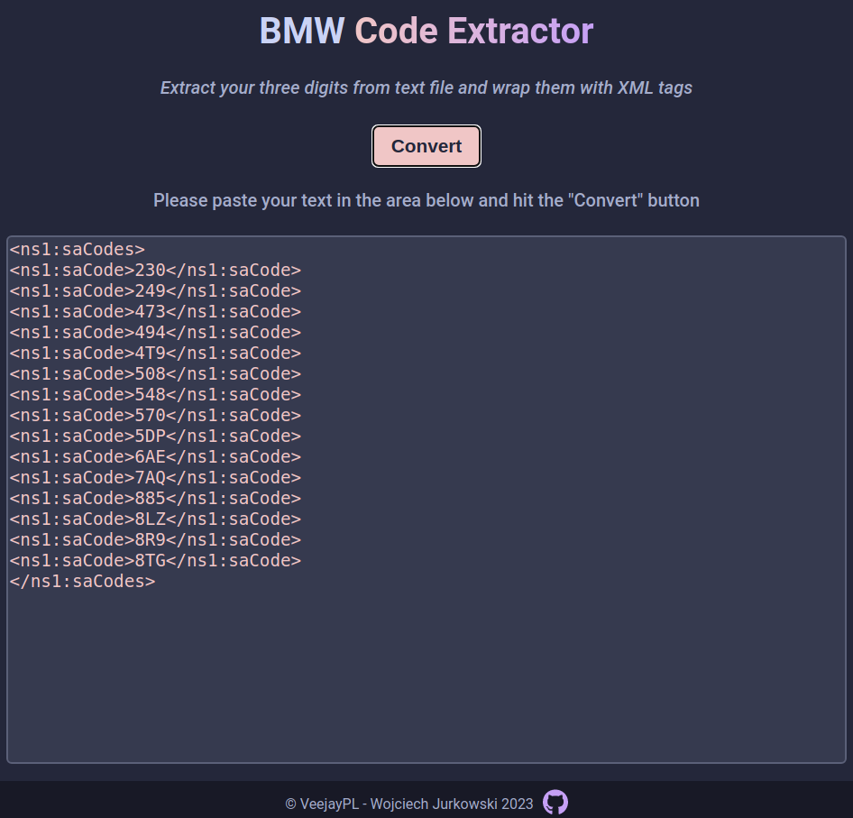

# Text to XML converter

## Description

This program extrudes the three digit code from text and wraps it within a XML tag. Works with multiple lines.

You can find below an example of input and the output as well as instructions on how to use the converter.

[Live demo](https://veejaypl.github.io/bmw-text-to-xml-converter/)

## Instructions

1. Copy text from your file
2. Paste inside the textarea
3. Hit convert button
4. The codes wrapped with the XML tags will appear in textarea where you have pasted your text
5. Copy the XML
6. If you have another file to be converted, simply copy and paste it over the textarea content

## Input

## Output

